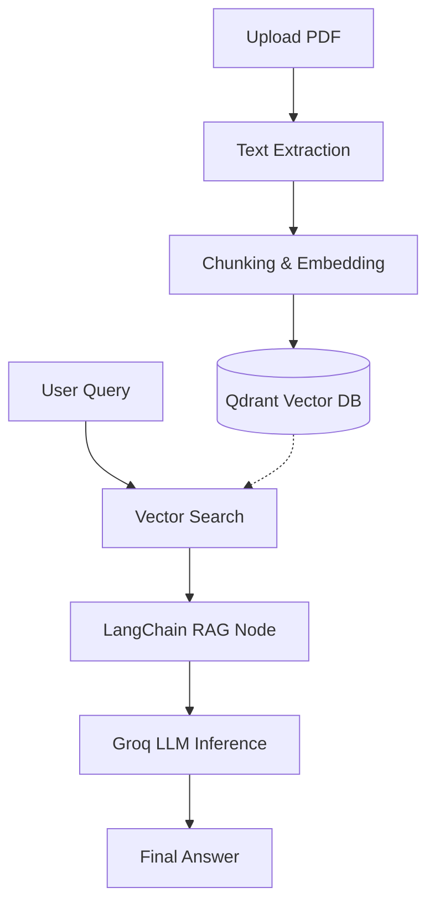

# 🎙️ Meeting Transcription Chatbot — Backend

A production-grade FastAPI backend powering the Meeting Transcription Chatbot. Features an end-to-end RAG pipeline using LangChain, Qdrant vector database, HuggingFace embeddings, and Groq API for low-latency natural language Q&A over meeting content.

🔗 **Frontend Repo**: [meeting_transcript_summarizer_assistant_rag_frontend](https://github.com/suprajasribalaji/meeting_transcript_summarizer_assistant_rag_frontend)

---

## ✨ Features

- 📄 **Transcript Ingestion**: Upload meeting transcripts (PDF) which are automatically chunked and indexed.
- 🔍 **Vector Search**: Uses HuggingFace embeddings stored in a Qdrant vector database for semantic retrieval.
- 🤖 **RAG Pipeline**: LangChain-powered Retrieval-Augmented Generation for context-aware Q&A.
- ⚡ **High Performance**: Groq API integration for lightning-fast LLM inference.
- 🔐 **Secure Auth**: Full authentication suite using Supabase Auth (JWT).
- 📂 **Session Management**: Persistent chat history and session tracking for each user.

---

## 🛠️ Tech Stack

| Layer | Technology |
|---|---|
| Framework | FastAPI |
| AI Orchestration | LangChain / LangGraph |
| LLM Provider | Groq API (Llama 3.1) |
| Embeddings | HuggingFace Sentence Transformers |
| Vector Database | Qdrant |
| Database & Auth | Supabase |

---

## 🏗️ RAG Architecture



---

## 🚀 Getting Started

### Prerequisites
- Python 3.11+
- Supabase Project (URL & Service Key)
- Qdrant Cluster (URL & API Key)
- Groq API Key

### Installation

```bash
# Navigate to project directory
cd meeting_transcription_summarizer_rag/backend

# Create and activate virtual environment
python -m venv .venv
source .venv/bin/activate  # Windows: .\.venv\Scripts\activate

# Install dependencies
pip install -r requirements.txt
```

### Environment Variables

Create a `.env` file in the `backend/` directory:

```env
# Supabase Configuration
SUPABASE_URL=your_supabase_url
SUPABASE_SERVICE_KEY=your_supabase_service_role_key

# Groq AI Configuration
GROQ_API_KEY=your_groq_api_key
GROQ_LLM_MODEL=llama-3.1-8b-instant

# Qdrant Vector DB
QDRANT_CLUSTER_ENDPOINT=your_qdrant_url
QDRANT_API_KEY=your_qdrant_api_key

# Hugging Face
HUGGINGFACE_EMBEDDING_MODEL=all-MiniLM-L6-v2
```

### Run Locally

For the standard package setup, run from the `backend/` root:

```bash
uvicorn app.main:app --reload
```

> **Note**: If you are running from inside the `app/` folder, use `uvicorn main:app --reload`.

---

## 📁 Project Structure

```
backend/
├── app/
│   ├── main.py              # FastAPI app entry point
│   ├── agents/              # LangGraph AI agents & RAG logic
│   ├── routes/              # Authentication routes
│   ├── services/            # Business logic (Sessions, Supabase, Qdrant)
│   └── utils/               # Helper functions
├── .env                     # Local environment variables
└── requirements.txt         # Python dependencies
```

---

## 📡 API Endpoints

| Method | Endpoint | Description |
|--------|----------|-------------|
| **Auth** | | |
| `POST` | `/auth/signup` | Register a new user |
| `POST` | `/auth/login` | Login and receive JWT |
| `POST` | `/auth/logout` | Invalidate current session |
| **Sessions** | | |
| `GET` | `/sessions/history` | List all meeting sessions for the user |
| `POST` | `/sessions/upload-pdf` | Upload a new transcript PDF and start a session |
| `GET` | `/sessions/{id}` | Get metadata for a specific session |
| `POST` | `/sessions/{id}/chat` | Send a message to the RAG chatbot |
| `DELETE` | `/sessions/{id}` | Delete a session and its vector index |

---

## 🔗 Related Resources

- [Frontend Repository](https://github.com/suprajasribalaji/meeting_transcript_summarizer_assistant_rag_frontend)
- Powered by [FastAPI](https://fastapi.tiangolo.com/), [LangChain](https://www.langchain.com/), and [Supabase](https://supabase.com/).

---
*Happy coding and enjoy building an elegant meeting‑transcription experience!*